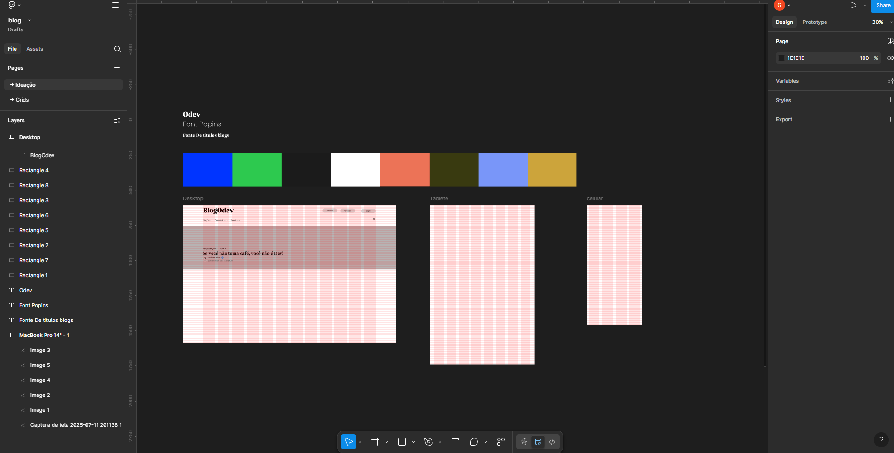

# 📝 Blog-Odev

🚧 **Projeto em fase de design**

Este será um blog focado em compartilhar conteúdos sobre **tecnologia**, **Qualidade industrial e de Software* e **UI/UX Design**.  
Ainda estou desenvolvendo o design e em breve começarei o desenvolvimento do site.

---

## Atualização de tecnologias 13/07/2025

Já defini alguns elementos cruciais para o andamento do design, como a paleta de cores, as três fontes principais e o grid base do projeto. Iniciei com um layout low-fidelity (lo-fi) para estruturar a ideia inicial sem muitos detalhes, mas ainda estou em busca de referências e inspirações para evoluir o visual da interface.




## 💡 Objetivo
Criar um espaço para troca de conhecimento e boas práticas no universo da tecnologia, com textos, dicas e tutoriais.

---

## 🚀 Status do Projeto
## 🚀 Status do Projeto
- [x] Fase de design
- [ ] Desenvolvimento 
- [ ] Testes e ajustes
- [ ] Preparação para publicação
- [ ] Publicação oficial
- [ ] Manutenção e atualizações contínuas

---


## 🔧 Tecnologias utilizadas (planejadas)
- TypeScript
- Express
- React
- Mysql(Banco de dados) with Type ORM
- Chakra ui 
- Figma (design)

---

## 📌 Funcionalidades planejadas
- [ ] Página inicial com posts
- [ ] Sistema de categorias
- [ ] Área para colaboradores/parceiros
- [ ] Login e autenticação para colaboradores
- [ ] Responsividade para dispositivos móveis
- [ ] Pagina Adm

---

## 🤝 Parcerias e contribuições
Aberto a parcerias para quem quiser colaborar com textos, ideias ou desenvolvimento do blog.  
Entre em contato para fazer parte!

---

## 📁 Como clonar o projeto

```bash
git clone https://github.com/Ghabriel-Silva/Blog-Odev.git
